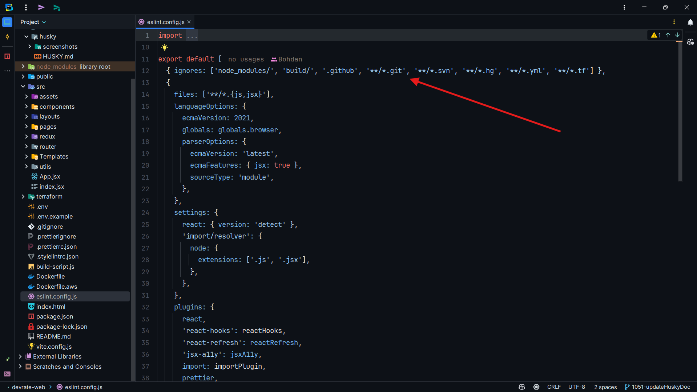

# Husky Documentation

# npx lint-staged

Команда npx lint-staged виконується перед комітом

Це дозволяє виконати перевірку коду перед комітом

# lint-staged

Команда lint-staged виконується перед комітом і перевіряє файли які знаходяться в git-стані modify (тобто ті файли 
які були змінені, модифіковані)

Виконуються команды:

Для файлів з розширенням .js та .jsx:
- prettier --write
- eslint --fix --max-warnings=0

Для файлів з розширенням .css та .scss:

- prettier --write
- stylelint --fix

# Ігнорування файлів для перевірки

### Ігнорування файлів для prettier

### Ігнорування файлів для eslint

Щоб ігнорувати файли від перевірки, потрібно вказати шлях до файлу в файлі .prettierignore або eslint.config.js